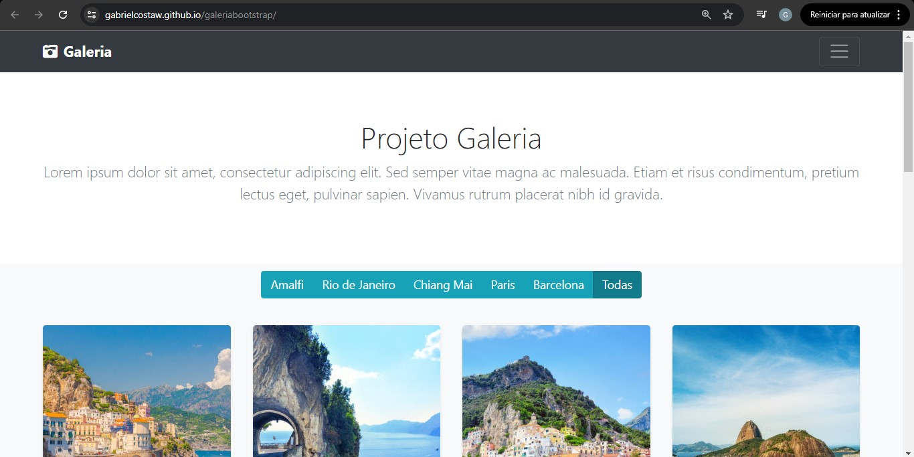
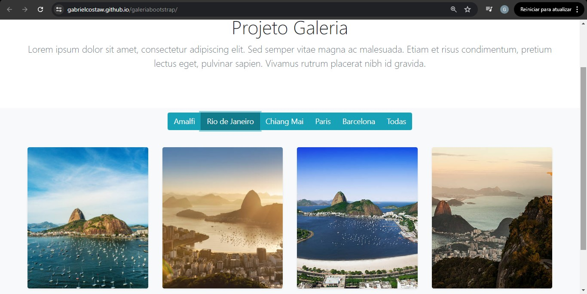

# ✈️ Galeria de Viagens Responsiva

> **Status do Projeto:** Concluído ✅  
> **Link para demonstração:** [Acesse a Galeria Aqui](https://gabrielcostaw.github.io/galeriabootstrap/)

Um projeto de galeria de fotos dinâmica focado em manipulação de DOM, filtragem de elementos e arquitetura de carregamento modular. Este projeto demonstra minha habilidade em organizar fluxos de desenvolvimento profissionais usando **Webpack** e **Sass**.

---

## 🖥️ Demonstração

Veja abaixo o sistema de filtragem e a interface responsiva em funcionamento:




---

## 🛠️ Tecnologias Utilizadas

Este projeto utiliza uma stack focada em performance e organização de código:

* **JavaScript (ES6) & jQuery**: Lógica de filtragem dinâmica e manipulação de eventos.
* **Ajax**: Carregamento modular de componentes (Header, Footer e Galeria).
* **Bootstrap 4**: Sistema de grid responsivo e utilitários.
* **Sass (SCSS)**: Estilização avançada com variáveis e mixins.
* **Webpack**: Empacotamento de módulos e automação do fluxo de build.
* **Font Awesome**: Ícones vetoriais para interface.

---

## 🚀 Funcionalidades Principais

* **Filtragem Automática**: O sistema identifica as cidades nas fotos e gera os botões de filtro dinamicamente.
* **Arquitetura Modular**: Uso de *includes* via Ajax para manter o código limpo e reutilizável.
* **Design Responsivo Adaptável**: 
    * **Mobile**: 10 colunas (filtros otimizados).
    * **Tablet**: 6 colunas.
    * **Desktop**: 3 colunas.
* **Sticky Footer**: Rodapé inteligente que garante a estética em qualquer resolução.

---

## 🧠 Aprendizados Técnicos

Neste projeto, foquei em resolver problemas reais de arquitetura front-end:
1.  **Manipulação de DOM**: Gerenciamento eficiente de elementos baseado na interação do usuário.
2.  **Automação**: Configuração de ambiente de desenvolvimento com Webpack.
3.  **UX Mobile**: Adaptação de componentes complexos para telas pequenas sem perda de funcionalidade.

---

## ⚙️ Como executar localmente

```bash
# 1. Clone o repositório
$ git clone [https://github.com/gabrielcostaw/projeto-galeria.git](https://github.com/gabrielcostaw/projeto-galeria.git)

# 2. Instale as dependências
$ npm install

# 3. Inicie o servidor de desenvolvimento
$ npm run dev


Estou em busca da minha primeira oportunidade como **Estagiário de Desenvolvimento**. Se você gostou deste projeto ou quer trocar uma ideia sobre tecnologia, sinta-se à vontade para me chamar!

* **LinkedIn:** [Gabriel Costa dos Santos](https://www.linkedin.com/in/gabriel-costa-228ab0382/)
* **E-mail:** [gcstsantos@gmail.com]
* **GitHub:** [gbcostaw](https://github.com/gabrielcostaw)